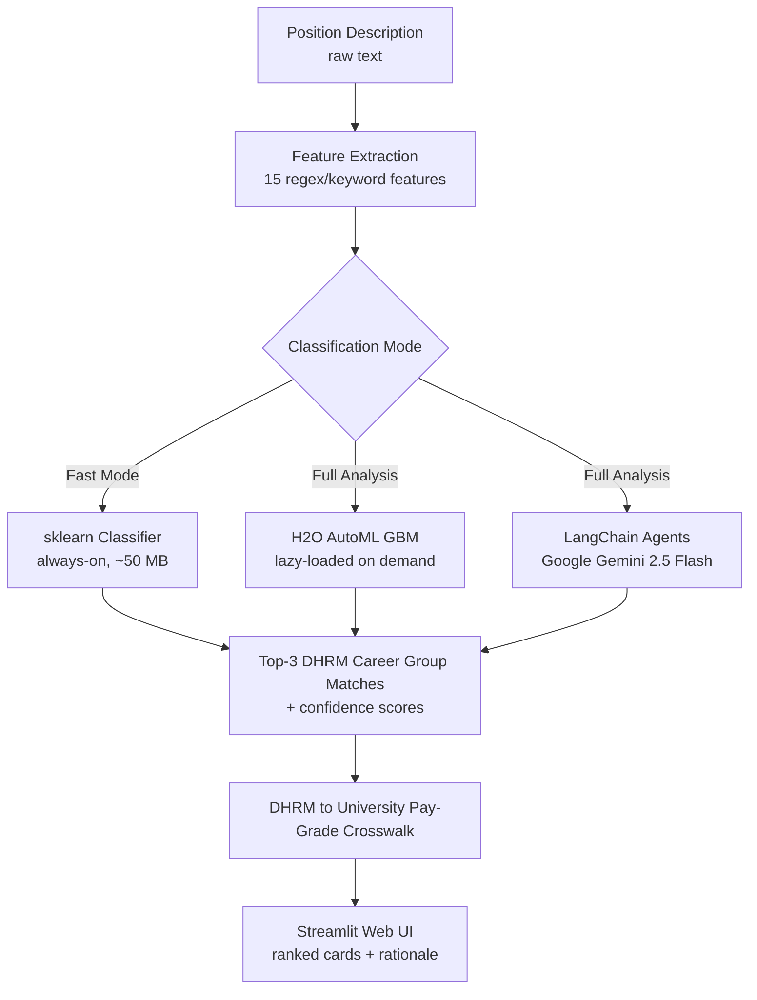
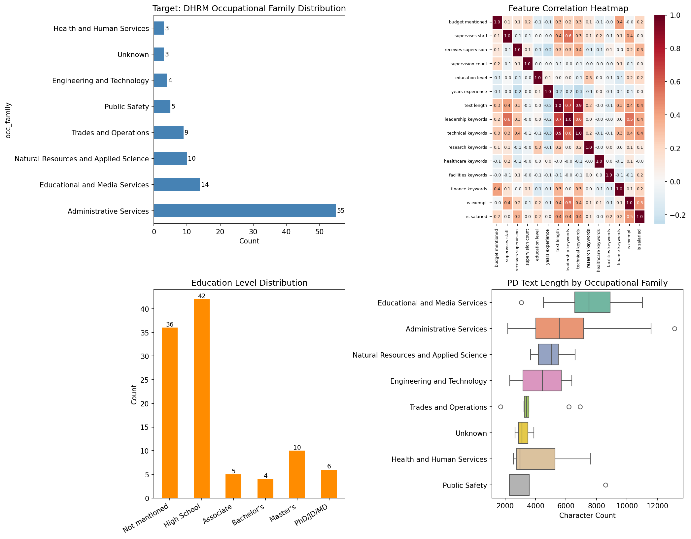
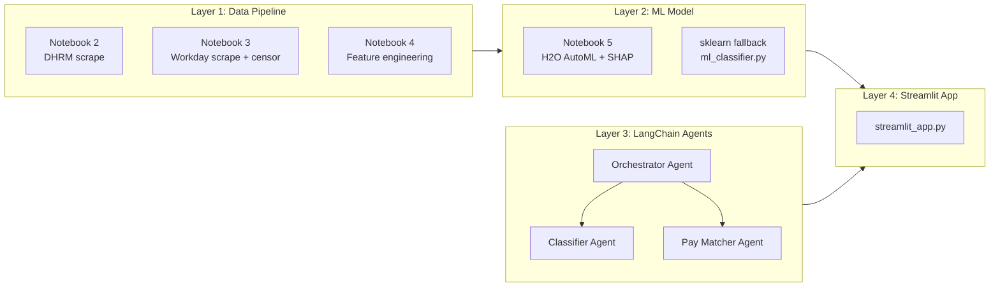
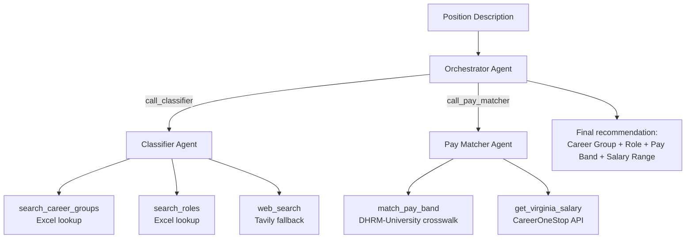

# GRIFFIN

**Agentic AI for public-sector HR position classification and pay-band recommendation**


**Live Demo:** [https://griffin-hr-classifier.streamlit.app](https://griffin-hr-classifier.streamlit.app)

**Repository:** [MSBA-Spring2026-Team-7/GRIFFIN-HR-Classification](https://github.com/MSBA-Spring2026-Team-7/GRIFFIN-HR-Classification)

**Project Board:** [GitHub Projects Kanban](https://github.com/orgs/MSBA-Spring2026-Team-7/projects/1)

| | |
|---|---|
| **Course** | BUAD 5742 — Artificial Intelligence (Spring 2026) |
| **Institution** | Raymond A. Mason School of Business, William & Mary |
| **Team** | Team 7 — Steven Alvarado, Anmol Motwani, Brynn Vetrano, Jhei-R Jones |
| **Client** | A public university HR department (anonymous) |
| **Acronym** | **G**overnment **R**ole **I**dentification and **F**inancial **F**ramework **I**ntegration **N**etwork |

---

## Table of Contents

1. [Project Importance & Visuals](#1-project-importance--visuals)
2. [Author List](#2-author-list)
3. [Project Scope](#3-project-scope)
4. [Project Details](#4-project-details)
5. [What's Next?](#5-whats-next)
6. [Responsible AI Considerations](#6-responsible-ai-considerations)
7. [References](#7-references)
8. [Acknowledgments](#acknowledgments)
9. [License](#license)
10. [Project Links](#project-links)

---

## 1. Project Importance & Visuals

Public universities and state agencies classify thousands of position descriptions (PDs) each year against complex job-family taxonomies — in Virginia's case, the Department of Human Resource Management (DHRM) career-group structure of **56 career groups and roughly 294 roles**, each tied to a specific pay band. Today this work is almost entirely manual: an HR analyst reads each PD, interprets the duties against compensable-factor language (Complexity, Results, Accountability), and assigns a classification that will directly shape an employee's compensation and career progression for years. The process is slow, expensive, inconsistent across reviewers, and vulnerable to silent bias.

**GRIFFIN** is an agentic AI system that helps public-sector HR teams classify unstructured position descriptions and recommend an appropriate pay band in seconds instead of hours — while keeping a human firmly in the decision seat. The system pairs a traditional machine-learning classifier (H2O AutoML + a scikit-learn fallback) with a three-agent LangChain pipeline driven by Google Gemini, and presents its top-3 ranked recommendations through a live Streamlit web application. Every recommendation carries a confidence score, a traceable rationale that cites the source duties, and a link to the underlying reference data. The business value is straightforward: faster classification, more consistent outcomes across reviewers, and an auditable trail that would be impossible to reconstruct from a manual workflow.

### System Architecture



*See `app/streamlit_app.py` for the deployed app, `notebooks/5_h2o_automl.ipynb` for the ML layer, and `app/griffin_langchain_agents.py` for the agent system.*

### Feature Engineering Overview



*Fifteen structured features extracted from each censored PD — word counts, supervisory indicators, budget language, technical terms, education requirements, and complexity markers. Full details in [`notebooks/4_feature_engineering.ipynb`](notebooks/4_feature_engineering.ipynb).*

---

## 2. Author List

| Name | Role | GitHub Profile |
|---|---|---|
| **Steven Alvarado** | Pipeline architecture, LangChain agent system, CQM orchestration | [github.com/Steven-Alvarado7](https://github.com/Steven-Alvarado7) |
| **Anmol Motwani** | Streamlit application, deployment, UX | [github.com/anmolmotwani](https://github.com/anmolmotwani) |
| **Brynn Vetrano** | Responsible AI research, Floridi framework analysis, ethics writeup | [github.com/bvetrano](https://github.com/bvetrano) |
| **Jhei-R Jones** | Presentation design, poster deck, narrative synthesis | [github.com/Jheir1](https://github.com/Jheir1) |

All four team members are MS Business Analytics (MSBA) candidates at William & Mary's Raymond A. Mason School of Business, Spring 2026 cohort.

---

## 3. Project Scope

### In Scope

GRIFFIN addresses a narrowly defined classification problem:

- **Input:** a single unstructured position description (raw text, copy-pasted from any HR system or Workday posting).
- **Classification target:** one of 56 Virginia DHRM career groups, and within that group, one of approximately 294 roles.
- **Output 1 — Top-3 ranked matches:** career group + role + confidence score (1–100) + plain-language rationale for each candidate, so the reviewer can see alternatives rather than a single opaque answer.
- **Output 2 — Pay-band recommendation:** the DHRM pay band (1–9) tied to the matched role, plus a crosswalked university pay grade (e.g., S18) and salary range derived from public Commonwealth of Virginia compensation data.
- **Output 3 — Explainability:** SHAP feature-importance analysis is performed during model training (notebook 5) and available as a reference artifact. In the deployed app, explainability is provided through structured LLM narratives that cite specific duties from the PD and map them to DHRM compensable factors (Complexity, Results, Accountability).

### Out of Scope

GRIFFIN is deliberately **not**:

- A decision-maker. It is an advisory tool — the HR professional reviews, accepts, modifies, or overrides every recommendation.
- A hiring-decision system. It does not screen, rank, or reject candidates.
- A compensation-setting system. It recommends a pay band from published DHRM tables; it never sets or negotiates salaries.
- An HRIS integration. The current system does not write back to Workday, Oracle HCM, or any system of record.
- A cross-jurisdictional classifier. The taxonomy is Commonwealth-of-Virginia-specific (DHRM). Adapting it to a different state or federal job-family structure would require retraining on that taxonomy's reference data.
- A benefits, FLSA, or EEO classifier. Those fields are deliberately stripped from training data to prevent leakage; the tool does not predict them.

### Why the scope is this narrow

The rubric rewards specificity, and the underlying operational reality demands it: public-sector classification mistakes are difficult to unwind and directly affect employee pay. Narrowing the system to *classification advisory for a single public taxonomy with a human in the loop* means every design decision — feature engineering, model choice, prompt scaffolding, UI affordances — can be optimized against that one goal. A broader "AI for HR" framing would dilute each of those decisions and, more importantly, would make the responsible-AI claims weaker.

---

## 4. Project Details

GRIFFIN is a four-layer stack. Each layer is independently testable and connects to the next through well-defined interfaces.

### 4.1 Architecture



Because the client's confidential position descriptions were not available for this project, GRIFFIN was trained and validated against **publicly available DHRM reference data and public Workday postings from a public university career site**. DHRM (Virginia's Department of Human Resource Management) is a public Commonwealth-of-Virginia data source, not the client — its career-group taxonomy, pay bands, and classification criteria are published government records.

### 4.2 Data Pipeline (Layer 1)

The pipeline lives in five numbered Jupyter notebooks, designed to run in order. Each notebook is self-contained and produces output files consumed by the next.

| Notebook | Purpose | Key outputs |
|---|---|---|
| [`1_environment_setup.ipynb`](notebooks/1_environment_setup.ipynb) | Verify packages, confirm Java is available for H2O, inventory `data/` | Env validation |
| [`2_dhrm_pipeline.ipynb`](notebooks/2_dhrm_pipeline.ipynb) | Scrape DHRM career-group taxonomy (50 HTML pages + 6 PDF pages, parsed with BeautifulSoup and pdfplumber) | 7 reference Excel files covering 56 career groups |
| [`3_workday_scrape.ipynb`](notebooks/3_workday_scrape.ipynb) | Scrape public Workday postings (150 scraped, 103 staff PDs retained) and apply a two-phase **censoring pipeline** that strips classification-revealing metadata | `workday_training.csv` with censored text + labels |
| [`4_feature_engineering.ipynb`](notebooks/4_feature_engineering.ipynb) | Extract 15 structured features (word count, supervisory indicators, budget language, technical terms, education requirements, complexity markers) via regex and keyword counting | `features_matrix.csv` |
| [`5_h2o_automl.ipynb`](notebooks/5_h2o_automl.ipynb) | Train H2O AutoML with 5-fold stratified cross-validation (80 models); generate SHAP global and per-prediction explanations | Saved models + SHAP plots |

The censoring pipeline in notebook 3 is worth highlighting: it applies 30+ skip patterns line-by-line to remove job-profile codes, compensation grades, dollar amounts, salary ranges, job-family labels, FLSA status, and EEO boilerplate. These fields would otherwise produce textbook data leakage — "perfect" training accuracy that collapses the moment the model sees a real PD.

**Public data sources used:**
- Virginia DHRM career-group and pay-band reference data (public government records).
- Public Workday postings from a public university career site (publicly accessible without authentication).
- CareerOneStop REST API (U.S. Department of Labor / ETA) for Virginia-localized salary percentiles by SOC code.

### 4.3 ML Model (Layer 2)

Layer 2 uses a **counterbalance architecture**: H2O AutoML as the primary model, scikit-learn as an always-on fallback, and lazy loading to keep the Streamlit Cloud free-tier build under its 1 GB memory cap. In the free-tier Streamlit Cloud deployment, the scikit-learn GBM fallback serves classifications because the H2O JVM requires more RAM than the 1 GB budget allows; locally and on adequately provisioned infrastructure, H2O serves as the primary classifier with background JVM warmup.

- **H2O AutoML.** 80 models trained over 5-fold stratified cross-validation. Best model: a Gradient Boosting Machine (GBM) with learning-rate annealing. On the held-out folds the GBM achieves roughly **69% top-1** and **90% top-3** accuracy, with a macro-F1 of **0.54** — the macro-F1 reflects real class imbalance (Administrative Services dominates the training set at 55/103 records; the smallest classes have only 3–4 records each). Full numbers and confusion matrices are in [`notebooks/5_h2o_automl.ipynb`](notebooks/5_h2o_automl.ipynb).
- **scikit-learn fallback.** `app/ml_classifier.py` also trains a lightweight sklearn classifier that loads in ~50 MB at app boot. This is the path used in Fast Mode and whenever H2O is unavailable (e.g., no JVM, hitting the Cloud memory cap). The fallback is not an afterthought — it is a first-class citizen of the architecture so the app degrades gracefully rather than erroring.
- **SHAP explainability.** Global feature-importance and per-prediction explanations are generated in notebook 5 using the `shap` library and are available as reference artifacts. The deployed app provides explainability through structured LLM narratives rather than SHAP visualizations.

### 4.4 LangChain Agent System (Layer 3)

Layer 3 is a three-agent LangChain pipeline driven by **Google Gemini (`gemini-2.5-flash`)**, integrated directly into the Streamlit application (not a separate script). The architecture follows the orchestrator-worker pattern used in the BUAD 5742 class materials. The system qualifies as genuinely *agentic*: agents autonomously select and invoke tools based on the input PD, maintain conversational memory via `InMemorySaver`, and the orchestrator coordinates multi-step reasoning across sub-agents rather than following a fixed sequential prompt chain.



- **Classifier Agent** — maps a PD to one of the 56 DHRM career groups and one of the ~294 roles, evaluating duties against the DHRM compensable factors (Complexity, Results, Accountability). Tools: `search_career_groups`, `search_roles`, `web_search`.
- **Pay Matcher Agent** — takes a classified position and returns a DHRM pay band, a crosswalked university pay grade, and a Virginia-localized salary range. Tools: `match_pay_band`, `get_virginia_salary`.
- **Orchestrator Agent** — coordinates the two sub-agents end-to-end. Each sub-agent is wrapped as a `@tool` callable (`call_classifier`, `call_pay_matcher`) following the pattern from the BUAD 5742 class Colab. Memory uses `InMemorySaver` so each classification session maintains its own conversational context.

The full agent code lives at [`app/griffin_langchain_agents.py`](app/griffin_langchain_agents.py); the design rationale and assignment 5 writeup are in [`reports/griffin_assignment5_report.md`](reports/griffin_assignment5_report.md).

### 4.5 Streamlit Web Application (Layer 4)

The user-facing layer is a single-file Streamlit app: [`app/streamlit_app.py`](app/streamlit_app.py). It is deployed live at **[https://griffin-hr-classifier.streamlit.app](https://griffin-hr-classifier.streamlit.app)**.

- **Two run modes.** *Fast Mode* uses only the sklearn classifier and returns results in under a second. *Full Analysis* adds the H2O AutoML model and the Gemini agent pipeline, takes 15–30 seconds, and produces a detailed LLM rationale for each of the top-3 matches.
- **Three-card triangulation.** The UI renders three recommendation cards — **Best Match**, **Alternative Role**, and **Alternative Group** — giving the reviewer a triangulated view rather than a single opaque answer. Each card shows the career-group name, the matched role, the DHRM pay band, the university pay grade, and an expandable rationale.
- **Dual confidence metrics.** Every recommendation carries two independent scores: an **ML Probability** (statistical confidence from the classifier) and an **AI Assessment** (LLM self-reported confidence), so the reviewer can gauge agreement between the two methods.
- **Word document export.** Users can export a complete classification report as a downloadable Word (.docx) document for offline review, record-keeping, or sharing with stakeholders who do not access the web app.
- **Secrets handling.** The app reads the Gemini API key from `st.secrets["GEMINI_API_KEY"]` (Streamlit Cloud), falling back to `os.environ` for local development via `python-dotenv`. Both `GEMINI_API_KEY` and `GOOGLE_API_KEY` are accepted for backward compatibility. See [`app/streamlit_app.py`](app/streamlit_app.py) lines 38–61 for the resolution logic.
- **Lazy H2O loading.** Streamlit Cloud's free tier budgets about 1 GB of RAM. Booting the H2O JVM at app import would consume most of that before a user did anything, so H2O is loaded only when the user clicks **Load ML reference model** in the sidebar. The sklearn fallback is pre-warmed at boot.

### 4.6 Getting Started (Run Locally)

GRIFFIN is tested on Windows 10/11 and macOS with Python 3.11.

```bash
# 1. Clone the repository
git clone https://github.com/MSBA-Spring2026-Team-7/GRIFFIN-HR-Classification.git
cd GRIFFIN-HR-Classification

# 2. Create the conda environment (installs Python 3.11, all packages, OpenJDK 11 for H2O)
conda env create -f environment-local.yml
conda activate griffin

# 3. Configure API keys
cp .env.example .env
# Edit .env and set GEMINI_API_KEY (or GOOGLE_API_KEY) to your Google Gemini key.
# Only the Gemini key is strictly required; the other keys (Tavily, CareerOneStop)
# enable optional fallbacks.

# 4. Run the Streamlit app
streamlit run app/streamlit_app.py
# Opens http://localhost:8501 in your browser.
```

Two dependency files are maintained in parallel:

- **[`environment-local.yml`](environment-local.yml)** — the canonical conda environment for full local development. Includes everything needed to run the notebooks (H2O, SHAP, BeautifulSoup, pdfplumber, SQLAlchemy, pymysql, OpenJDK 11). Named `environment-local.yml` (not `environment.yml`) so Streamlit Community Cloud falls back to `requirements.txt` instead of attempting a conda build that silently skips the pip subsection.
- **[`requirements.txt`](requirements.txt)** — the trimmed pip dependency list used by Streamlit Community Cloud. Includes only what the deployed app imports (Streamlit, google-generativeai, pandas, numpy, openpyxl, scikit-learn, H2O). Notebook-only packages are intentionally excluded to keep the cloud build under the 1 GB free-tier memory cap.

For full Streamlit Cloud deployment instructions, see **[`docs/DEPLOYMENT.md`](docs/DEPLOYMENT.md)**.

### 4.7 Code Demo

The professor and poster judges can run GRIFFIN two ways:

1. **Live web app** — [https://griffin-hr-classifier.streamlit.app](https://griffin-hr-classifier.streamlit.app). Paste a position description (a validated end-to-end test case is "Assistant Controller", which classifies to *Financial Services Manager III*, DHRM Band 7, university grade S18).
2. **Local notebooks** — the five numbered notebooks in [`notebooks/`](notebooks/) reproduce the full data pipeline and model training from scratch. Notebook 5 also generates the SHAP explainability plots.

Both the app entry point ([`app/streamlit_app.py`](app/streamlit_app.py)) and the agent system ([`app/griffin_langchain_agents.py`](app/griffin_langchain_agents.py)) are well-commented and runnable in the `griffin` conda environment.

---

## 5. What's Next?

### Planned Developments

1. **GCP Cloud SQL deployment.** A 9-table SQL schema and SQLAlchemy migration layer are already built and tested against a local SQLite fallback. Moving to Cloud SQL would enable multi-user access, persistent classification history, and audit logs — the code path is deployment-ready, pending a production GCP instance.
2. **Expanded training corpus.** The current 103-PD training set is small and imbalanced. Adding PDs from additional public-university departments (particularly Engineering & Technology and Health & Human Services, which currently have only 3–4 records each) would materially improve minority-class accuracy.
3. **Class-weighted re-training.** Applying explicit class weights or focal-loss re-training during the H2O AutoML stage would directly address the Administrative-Services dominance in the current training set and raise macro-F1 without requiring more data.
4. **Multi-tenant taxonomy support.** The agent tool layer is already data-driven (Excel lookups), so swapping the DHRM taxonomy for another state's job-family structure is mostly a data-loading change. Supporting multiple public universities or state agencies from a single deployment is a concrete roadmap item.
5. **Multi-turn classification sessions.** The LangChain orchestrator already uses `InMemorySaver` for session memory. Exposing this through the Streamlit UI — so an HR analyst can say "now classify this same role but at a supervisory level" — is a low-effort, high-value UX upgrade.
6. **Workday / HRIS integration.** The current app is read-only. Adding a write-back path into Workday or Oracle HCM (behind an explicit human approval step) would close the loop from recommendation to record.

### Concerns and Risks for Scaling

1. **Model drift on annual pay-band updates.** DHRM pay bands and crosswalks change roughly once per year. Without a scheduled retraining and reference-data refresh, GRIFFIN's recommendations will silently go stale. A production deployment needs a monitored retraining cadence.
2. **LLM cost at scale.** Every Full Analysis classification currently makes several Gemini calls. For a high-volume HR department running hundreds of classifications a day, Gemini API costs and rate-limit behavior need active budgeting. Fast Mode mitigates this for bulk workflows.
3. **Bias auditing cadence.** Small, imbalanced training data plus downstream pay implications is a known-risky combination. A production deployment needs a recurring fairness audit — both representational (how career groups are characterized) and allocational (whether the model's pay-band recommendations correlate with protected attributes on real PDs). This is an operational commitment, not a one-time check.
4. **Human-review throughput.** GRIFFIN is explicitly human-in-the-loop, which means its practical scaling ceiling is the HR team's review capacity. Throwing more model at the problem without a matching investment in reviewer tooling would be a governance mistake.
5. **Confidential-data boundary.** The current prototype was built without access to confidential client PDs. A production deployment handling confidential PDs would need to revisit the data flow to Google's Gemini endpoint — either via an on-premise model, a VPC-isolated endpoint, or explicit data-processing agreements.

---

## 6. Responsible AI Considerations

GRIFFIN's ethical posture is an integrated set of engineering decisions, not a separate compliance exercise. Following **Floridi's AI4People ethical framework** (beneficence, nonmaleficence, autonomy, justice, and explicability), we mapped each principle to a specific design decision in the codebase. The team's canonical writeup is at [`reports/Responsible AI Considerations.pdf`](reports/Responsible%20AI%20Considerations.pdf); the engineering-level reflection with code pointers is at [`reports/ethical_reflection.md`](reports/ethical_reflection.md).

### Beneficence and Nonmaleficence — doing good, avoiding harm

GRIFFIN is designed to help HR professionals produce faster, more consistent pay-band recommendations. The "doing good" side is straightforward: a tool that takes hours of manual classification work down to seconds, with visible rationale the reviewer can audit. The "avoiding harm" side is stricter. Misclassifying a position directly affects an employee's compensation and career progression, and an LLM that confidently hallucinates a career group would be actively harmful. We counter this with a **dual-method counterbalance architecture** (ML classifier + independent LLM agent), **explicit confidence scores** on every recommendation, and a **top-3 ranked display** so the reviewer sees alternatives rather than a single opaque answer.

### Autonomy — the human keeps the decision

Autonomy is preserved by construction: GRIFFIN recommends, the HR professional decides. The Streamlit app never auto-submits a classification, never writes to any HR system of record, and never removes the human from the decision loop. The workflow is deliberately structured — paste PD, receive ranked recommendations with rationale, review, accept or override. Classification decisions affect employee compensation and career progression, and that authority must remain with qualified HR professionals.

### Justice — bias and fairness

AI models trained on real-world data can inadvertently encode and perpetuate societal biases. We actively designed against both **representational harm** (negative shifts in how specific groups are portrayed) and **allocational harm** (inequitable distribution of resources or opportunities, such as biased pay-band assignments). Three concrete mitigations:

- **Training-data transparency.** The 103-PD training set has significant class imbalance (Administrative Services: 55 records; Engineering & Technology and Health & Human Services: 3–4 records each). This is explicitly documented in [`notebooks/4_feature_engineering.ipynb`](notebooks/4_feature_engineering.ipynb) and is one of the main reasons GRIFFIN is framed as an advisory tool.
- **Stratified cross-validation.** [`notebooks/5_h2o_automl.ipynb`](notebooks/5_h2o_automl.ipynb) uses 5-fold stratified CV so minority classes are represented in every fold.
- **Censoring against leakage.** [`notebooks/3_workday_scrape.ipynb`](notebooks/3_workday_scrape.ipynb) applies 30+ skip patterns to strip classification-revealing metadata (job-profile codes, compensation grades, salary ranges, FLSA status, EEO boilerplate) before any ML training.

### Explicability — transparency and explainability

A common criticism of AI systems is that they are opaque "black boxes." GRIFFIN addresses this at three levels: (1) the ML layer produces **SHAP global feature-importance and per-prediction explanations** via the `shap` library during model training (notebook 5), available as reference artifacts; (2) the deployed app provides explainability through **structured LLM narratives** that cite specific duties from the PD and map them to DHRM compensable factors (Complexity, Results, Accountability); and (3) the LangChain agent pipeline is **auditable end-to-end** — classifier, pay matcher, orchestrator, and their tool calls are all visible in `app/griffin_langchain_agents.py` and produce traceable intermediate output rather than a single unexplained answer.

### Privacy and Data Ethics

No personally identifiable information (names, contact information, individual salary data) appears anywhere in the training pipeline. All DHRM source data is **public Commonwealth-of-Virginia government records**; the scraper is rate-limited (1.5-second delay) and caches every fetched page locally so each URL is requested at most once. Training PDs come from **public Workday postings** accessible without authentication. The censoring pipeline in notebook 3 removes every classification-revealing field before the text ever reaches the model. The `budget_amount_max` feature was ultimately dropped from the feature set because dollar amounts had already been stripped during censoring.

### Accountability and API Security

All credentials (Gemini, Tavily, CareerOneStop) are loaded from environment variables via `python-dotenv` and read from `os.environ` with explicit missing-key handling. The repository ships `.env.example` with placeholder values only; `.env` is listed in `.gitignore` and has been audited against `git log --all -- .env`. No API keys are hardcoded in source files anywhere in the project. For Streamlit Cloud deployment, the Gemini key is configured through the Streamlit Secrets UI — see [`docs/DEPLOYMENT.md`](docs/DEPLOYMENT.md).

### Known Limitations

The responsible-AI work is not finished and never will be. The most important open items: (a) the training set is small and imbalanced, so confidence on underrepresented career groups is inherently lower — this is why GRIFFIN always returns a top-3 ranked list with alternatives; (b) the LLM layer depends on a hosted API (Google Gemini), which introduces a data-flow consideration for any future deployment handling confidential PDs; and (c) a production deployment would need a recurring bias audit cadence (see §5, Concerns and Risks for Scaling).

---

## 7. References

### Key Research Paper

**[Large language models for competence-based HRM: A case study in the aerospace industry](https://doi.org/10.1016/j.jik.2025.100780)**

Barba, G., Corallo, A., Lazoi, M., & Lezzi, M. (2025). *Journal of Innovation & Knowledge*, 10(4), 100780. https://doi.org/10.1016/j.jik.2025.100780

- **Local copy:** [`docs/research/research paper.pdf`](docs/research/research%20paper.pdf)
- **License:** CC BY-NC-ND 4.0 (open access)
- **Published:** August 2025 (Received Oct 2024; Accepted Aug 2025)
- **Venue:** Journal of Innovation & Knowledge (Elsevier; peer-reviewed Q1)

**Relevance to GRIFFIN:**

> Barba et al. present two LLM-based methodologies for competence-based HRM: the Automated Semantic Taxonomy Enrichment Methodology (ASTEM) and the Role-Competence Embedding-based (RCE) framework. Their approach uses LLMs to generate coherent competence descriptions and create role-competence associations through semantic similarity — conceptually parallel to GRIFFIN's agentic classification of unstructured position descriptions against the DHRM career-group taxonomy. Their case study validates the approach in a high-stakes aerospace context; GRIFFIN extends the same pattern to public-sector HR classification with a dual ML + LLM counterbalance architecture. This paper provides both methodological grounding and external validation for the core technical premise of our project.

### Technology and Tools

- [Streamlit](https://streamlit.io/) — the web-application framework hosting the live demo
- [Google Gemini (`google-generativeai`)](https://ai.google.dev/) — LLM provider for the agentic layer
- [LangChain](https://python.langchain.com/) — agent framework used for the three-agent pipeline
- [LangGraph](https://langchain-ai.github.io/langgraph/) — stateful agent orchestration primitives
- [H2O AutoML](https://docs.h2o.ai/h2o/latest-stable/h2o-docs/automl.html) — automated machine-learning library used in notebook 5
- [scikit-learn](https://scikit-learn.org/) — the always-on fallback classifier in `app/ml_classifier.py`
- [SHAP](https://shap.readthedocs.io/) — explainability library for the ML layer
- [pandas](https://pandas.pydata.org/), [NumPy](https://numpy.org/), [openpyxl](https://openpyxl.readthedocs.io/) — data handling and Excel I/O
- [BeautifulSoup](https://www.crummy.com/software/BeautifulSoup/) and [pdfplumber](https://github.com/jsvine/pdfplumber) — scraping and PDF parsing
- [SQLAlchemy](https://www.sqlalchemy.org/) and [PyMySQL](https://pymysql.readthedocs.io/) — database layer with GCP Cloud SQL path
- [python-dotenv](https://github.com/theskumar/python-dotenv) — local environment variable loading
- [Plotly](https://plotly.com/python/), [seaborn](https://seaborn.pydata.org/), [matplotlib](https://matplotlib.org/) — visualization
- [OpenJDK 11](https://openjdk.org/) — JVM required by H2O

Every technology listed here appears either in [`environment-local.yml`](environment-local.yml) (full local dev) or in [`requirements.txt`](requirements.txt) (Streamlit Cloud build).

### Data Sources

- [Virginia Department of Human Resource Management (DHRM)](https://www.dhrm.virginia.gov/) — public Commonwealth-of-Virginia career-group, role, and pay-band reference data.
- [CareerOneStop REST API](https://www.careeronestop.org/) — U.S. Department of Labor / Employment and Training Administration (USDOL/ETA), used for Virginia-localized salary percentiles by SOC code.
- Public Workday postings from a public university career site — used only as training input, fully censored before any ML use.

> **Data Attribution:** Salary benchmarking data provided by [CareerOneStop](https://www.careeronestop.org/), sponsored by the U.S. Department of Labor, Employment and Training Administration (USDOL/ETA). This project does not reflect the official position of USDOL/ETA, and USDOL/ETA makes no guarantees, warranties, or assurances of any kind with respect to such information.

### Course Materials

- BUAD 5742 — Artificial Intelligence, Raymond A. Mason School of Business, William & Mary (Spring 2026).
- BUAD 5722 — Big Data Analytics, Raymond A. Mason School of Business, William & Mary (Spring 2026).
- [Official grading rubric (archived)](archive/references/Grading%20Rubric%20for%20AI%20Course.txt)

---

## Acknowledgments

We thank **William & Mary's Human Resources department** for generously sharing their domain expertise and answering our questions about public-sector HR classification workflows throughout this project. Their guidance as subject-matter experts was invaluable in shaping our understanding of the DHRM pay-band system, the real-world challenges of position-description classification, and the operational constraints that HR analysts face every day. William & Mary HR served as an advisor to the team — the classification client itself is a separate public-university HR department and is not named in this repository.

We also thank:

- Our BUAD 5742 and BUAD 5722 faculty for their guidance on responsible AI development and practical machine learning.
- The [H2O.ai](https://h2o.ai/) community for AutoML tooling and documentation.
- The [LangChain](https://langchain.com/) and [Streamlit](https://streamlit.io/) communities whose open-source work this project is built on.
- [CareerOneStop](https://www.careeronestop.org/) and USDOL/ETA for maintaining the public salary API that grounds GRIFFIN's pay-band recommendations in real labor-market data.

---

## License

This project is released under the **MIT License**. The research paper PDF in `docs/research/` is reproduced under its original CC BY-NC-ND 4.0 open-access license (see §7).

---

## Project Links

- **Live Demo:** [https://griffin-hr-classifier.streamlit.app](https://griffin-hr-classifier.streamlit.app)
- **GitHub Repository:** [MSBA-Spring2026-Team-7/GRIFFIN-HR-Classification](https://github.com/MSBA-Spring2026-Team-7/GRIFFIN-HR-Classification)
- **Project Kanban Board:** [https://github.com/orgs/MSBA-Spring2026-Team-7/projects/1](https://github.com/orgs/MSBA-Spring2026-Team-7/projects/1)
- **Deployment Runbook:** [`docs/DEPLOYMENT.md`](docs/DEPLOYMENT.md)
- **Research Paper (local):** [`docs/research/research paper.pdf`](docs/research/research%20paper.pdf) — Barba et al. (2025), DOI: [10.1016/j.jik.2025.100780](https://doi.org/10.1016/j.jik.2025.100780)
- **Grading Rubric (archived):** [`archive/references/Grading Rubric for AI Course.txt`](archive/references/Grading%20Rubric%20for%20AI%20Course.txt)
- **Responsible AI writeup:** [`reports/Responsible AI Considerations.pdf`](reports/Responsible%20AI%20Considerations.pdf)
- **Ethical reflection (engineering):** [`reports/ethical_reflection.md`](reports/ethical_reflection.md)
