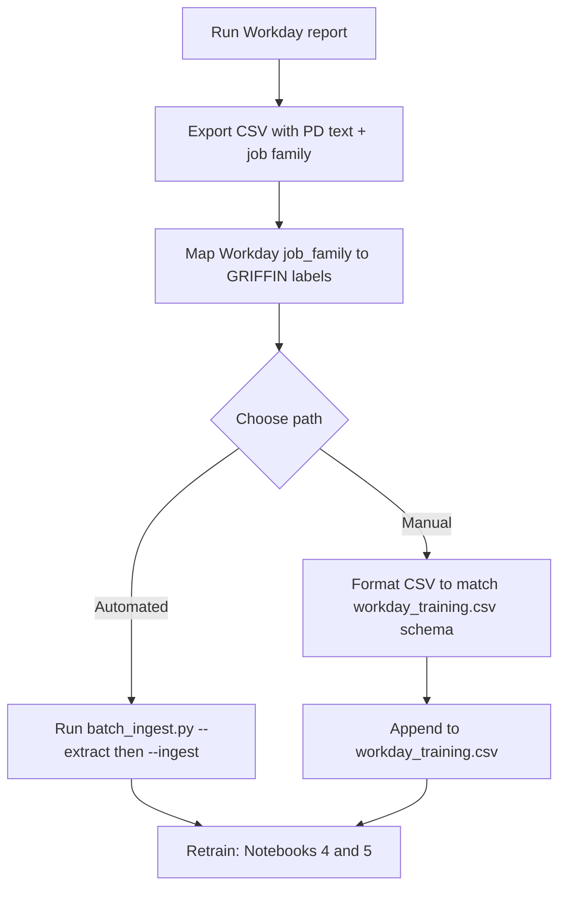
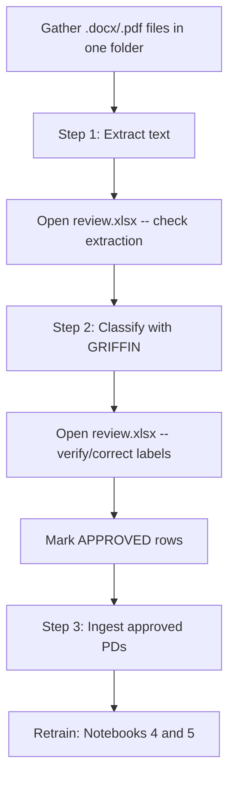
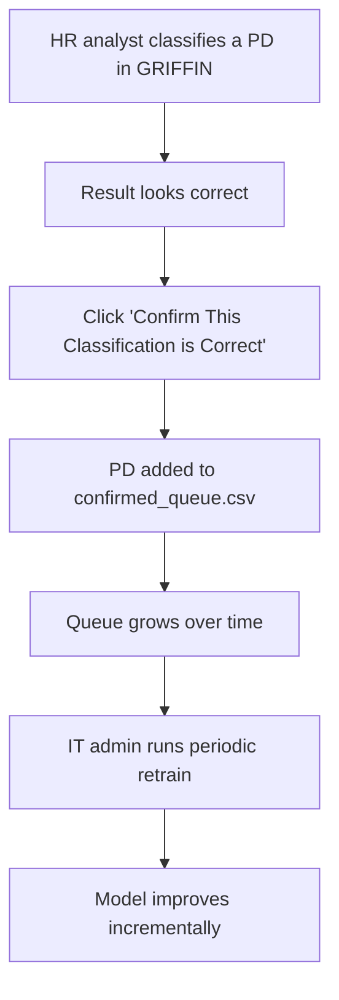

# Adding Your Position Descriptions to GRIFFIN

## Data Onboarding Guide

> **Audience:** IT staff who will run the tools + HR managers who approve the labels.
> No coding experience required beyond running a command and reviewing a spreadsheet.

---

## Table of Contents

1. [Why This Matters](#1-why-this-matters)
2. [What You Need Per Position Description](#2-what-you-need-per-position-description)
3. [Three Scenarios for Adding Data](#3-three-scenarios-for-adding-data)
4. [PII Scrubbing Checklist](#4-pii-scrubbing-checklist)
5. [Retraining After Adding Data](#5-retraining-after-adding-data)
6. [Label Mapping Reference](#6-label-mapping-reference)
7. [FAQ](#7-faq)
8. [Important Note on Direct Upload](#8-important-note-on-direct-upload)

---

## 1. Why This Matters

GRIFFIN's classification accuracy is directly proportional to how many real position descriptions (PDs) it has learned from. Right now:

| Occupational Family | Training PDs | Strength |
|---|---|---|
| Administrative Services | 55 | Strong |
| Educational and Media Services | 14 | Moderate |
| Natural Resources and Applied Science | 10 | Moderate |
| Trades and Operations | 9 | Developing |
| Public Safety | 5 | Weak |
| Engineering and Technology | 4 | Weak |
| Health and Human Services | 3 | Weak |
| Unknown / Unmapped | 3 | -- |
| **Total** | **103** | |

**The goal: go from 103 generic PDs to 500+ real PDs** drawn from your organization's actual positions.

The impact is straightforward: Administrative Services has 55 training examples, so GRIFFIN is already strong there. Engineering and Technology has 4 examples -- GRIFFIN is essentially guessing. Your real PDs fix this imbalance. Every confirmed PD makes GRIFFIN smarter.


---

## 2. What You Need Per Position Description

### Required Fields

| Field | Description | Example |
|---|---|---|
| `censored_text` | The full position description with all PII removed | "Manages procurement operations for..." |
| `job_family` | The correct Workday job family label (see [Section 6](#6-label-mapping-reference) for valid values) | "Staff - Fiscal Administration" |

### Nice-to-Have Fields

| Field | Description | Example |
|---|---|---|
| `compensation_grade` | Pay band / salary grade | "S14" |
| `job_profile_code` | Workday job profile identifier | "JPM003" |
| `exempt_status` | FLSA exemption status | "Exempt" |
| `pay_type` | Salaried or Hourly | "Salaried" |

> **Insight:** Even if you only have the PD text and the correct label, that is enough. The nice-to-have fields improve pay-band prediction but are not required for classification training.

### Valid `job_family` Values (30 Labels)

These must match exactly (case-sensitive). The batch_ingest tool will reject any label not on this list.

| # | job_family |
|---|---|
| 1 | Staff - Academic Program Administration |
| 2 | Staff - Administrative & Office Support |
| 3 | Staff - Admissions & Enrollment |
| 4 | Staff - Alumni Affairs |
| 5 | Staff - Athletic Training & Wellbeing |
| 6 | Staff - Athletics Operations |
| 7 | Staff - Building Services |
| 8 | Staff - Career Services |
| 9 | Staff - Communications |
| 10 | Staff - Community Relations |
| 11 | Staff - Compliance |
| 12 | Staff - Financial Analysis |
| 13 | Staff - Fiscal Administration |
| 14 | Staff - Giving: Annual, Major Gifts, & Planned |
| 15 | Staff - HR Business Partner |
| 16 | Staff - Instructional Development & Design |
| 17 | Staff - Lab & Research Support |
| 18 | Staff - Librarians |
| 19 | Staff - Maintenance |
| 20 | Staff - Media & Creative Services |
| 21 | Staff - Medical |
| 22 | Staff - Program Management |
| 23 | Staff - Public Relations |
| 24 | Staff - Scientist |
| 25 | Staff - Security - Law Enforcement Officer |
| 26 | Staff - Security - Non Law Enforcement Officer |
| 27 | Staff - Software Programming & Applications |
| 28 | Staff - Stewardship & Donor Relations |
| 29 | Staff - Student Services |
| 30 | Staff - User Support |

---

## 3. Three Scenarios for Adding Data

### Scenario A: Workday HRIS Export (Best Case -- Bulk)

**Who:** HR admin with Workday report access + IT for running the tool

**When to use:** Your organization already has PDs stored in Workday and can run a report export.



**Steps:**

1. **Run a Workday report** that exports all active position descriptions. Include at minimum: position title, full PD text, job family, and compensation grade.

2. **Map job family labels.** Your Workday job_family values must exactly match one of the 30 valid labels listed in [Section 2](#valid-job_family-values-30-labels). See the [Label Mapping Reference](#6-label-mapping-reference) for how job families roll up to occupational families.

3. **Choose your path:**
   - **Automated path:** Save documents to a folder and run the batch_ingest tool (see Scenario B for command details). This handles text standardization and lets GRIFFIN pre-classify for verification.
   - **Direct CSV path:** Format your export as a CSV with columns matching `workday_training.csv` (see [Required Fields](#required-fields)). Append directly to `data/training/workday_training.csv`.

4. **Scrub PII** before adding any data. See [Section 4](#4-pii-scrubbing-checklist).

5. **Retrain** the model. See [Section 5](#5-retraining-after-adding-data).

**Timeline:** 1 afternoon with IT support.

---

### Scenario B: Folder of Word/PDF Documents (Common)

**Who:** IT runs the commands. HR reviews the spreadsheet.

**When to use:** Your PDs are stored as `.docx` or `.pdf` files on a shared drive, local folder, or email attachments.



**Step-by-step:**

**Step 1 -- Extract text from documents**

```bash
python tools/batch_ingest.py --extract --input-dir "path/to/pds" --output review.xlsx
```

This reads every `.docx` and `.pdf` in the folder, pulls out the text, and writes a spreadsheet. Corrupted or password-protected files are marked `EXTRACT_FAILED` and skipped automatically.

**Step 2 -- Open the spreadsheet and check extraction**

Open `review.xlsx` in Excel. Verify that the `extracted_text` column contains readable position description text. Look for:
- Garbled text (PDF extraction issues)
- Missing content (partial extraction)
- Files that are not actually PDs (org charts, cover letters, etc.)

Remove or flag any rows with bad extractions.

**Step 3 -- Run GRIFFIN classification**

```bash
# Classification only
python tools/batch_ingest.py --classify --input review.xlsx --api-key "YOUR_GEMINI_KEY"

# Classification + AI-assisted PII detection (recommended)
python tools/batch_ingest.py --classify --input review.xlsx --api-key "YOUR_GEMINI_KEY" --ai-clean
```

This adds new columns to the spreadsheet: `ml_prediction`, `ml_confidence`, `ai_career_group`, `occ_family_suggested`, `correct_label`, and more. With `--ai-clean`, you also get `pii_flags`, `cleaned_text`, and `boilerplate_removed`.

> **Note:** A paid Gemini API tier is recommended for production use. The default `--delay 2` adds a 2-second pause between API calls as a safety margin. With a paid account, use `--delay 0` for full speed.

**Step 4 -- Review and confirm labels**

Open `review.xlsx` again. For each row:
- The `correct_label` column is pre-filled with GRIFFIN's suggested classification
- **Confirm** the suggestion is correct, OR **change** `correct_label` to the right job_family value
- Check the `pii_flags` column (if you used `--ai-clean`) for any PII that needs removal
- Set the `status` column to `APPROVED` for rows ready to ingest

See [`sample_review.xlsx`](sample_review.xlsx) in this folder for a pre-filled example showing approved, corrected, and pending rows.

**Step 5 -- Ingest approved PDs**

```bash
python tools/batch_ingest.py --ingest --input review.xlsx
```

Only rows marked `APPROVED` with valid `correct_label` values will be added. The tool validates every label against the master list and rejects unrecognized entries.

**Step 6 -- Retrain the model**

Follow the 5-step retrain checklist in [Section 5](#5-retraining-after-adding-data).

**Timeline:** 1-2 days depending on volume (most time is in the HR review step, not the tools).

---

### Scenario C: Organic Growth (Zero Extra Effort)

**Who:** HR analysts using GRIFFIN daily + IT admin for periodic retraining

**When to use:** You do not have a batch of PDs ready to go, but your team uses GRIFFIN for day-to-day classification.



**How it works:**

1. HR analysts use the GRIFFIN Streamlit app for their normal classification work.
2. When a classification result is correct, the analyst clicks **"Confirm This Classification is Correct"** in the app.
3. The confirmed PD is appended to `data/training/confirmed_queue.csv`.
4. Periodically (weekly or monthly), the IT admin runs the retrain cycle (Notebooks 4 and 5) to incorporate confirmed PDs into the model.

**No dedicated data-collection effort is required.** The training data grows naturally as part of normal operations.

**Timeline:** Ongoing. No dedicated effort required.

---

## 4. PII Scrubbing Checklist

Position descriptions entering GRIFFIN's training data must have all personally identifiable information removed. This protects employees and ensures compliance with data handling policies.

### Must Remove

| PII Type | Example | What to Do |
|---|---|---|
| Employee names | "Reports to Jane Smith" | Replace with title: "Reports to Department Director" |
| Supervisor names | "Supervised by John Doe" | Replace with title |
| Employee IDs | "EMP-20453" | Delete entirely |
| Social Security Numbers | "SSN: 123-45-6789" | Delete entirely |
| Phone numbers | "(757) 221-4000" | Delete entirely |
| Email addresses | "jsmith@wm.edu" | Delete entirely |
| Specific salary amounts | "Salary: $65,000" | Delete or replace with band: "Pay Band 4" |
| Department budget figures | "manages $2.3M budget" | Replace with: "manages departmental budget" |
| Codes tracing to individuals | "CC00497-Smith" | Remove the personal identifier portion |

### Can Stay

| Content Type | Why It Is Safe |
|---|---|
| Job title | Public information, needed for classification |
| Duty descriptions | Core of the PD, no PII |
| Percentage breakdowns | "40% program management, 30% supervision" -- generic |
| Required education/experience | "Master's degree required" -- generic |
| Reporting relationships by title | "Reports to the Associate Vice President" -- no name |
| Qualifications and certifications | "CPA preferred" -- generic |
| Physical requirements | "Must lift 50 lbs" -- generic |

### Automated PII Detection

Use the `--ai-clean` flag with batch_ingest.py for AI-assisted PII scanning:

```bash
python tools/batch_ingest.py --classify --input review.xlsx --api-key "YOUR_KEY" --ai-clean
```

This adds a `pii_flags` column to the spreadsheet with entries like:
- `PII_FLAG: name found at: 'Reports to Jane Smith'`
- `PII_FLAG: email found at: 'jsmith@wm.edu'`

> **Important:** AI PII detection is advisory. The HR reviewer makes the final decision on every flag. Some flags may be false positives (e.g., a job title that looks like a name). Always review before approving.

---

## 5. Retraining After Adding Data

After new PDs have been ingested into `data/training/workday_training.csv`, the model must be retrained to learn from them. Follow these five steps in order:

### Retrain Checklist

- [ ] **Step 1: Verify new data.** Open `data/training/workday_training.csv` and confirm the new rows are present. Check the total row count (should be higher than before). Spot-check 3-5 new entries to verify text and labels look correct.

- [ ] **Step 2: Run Notebook 4 (Feature Engineering).** Open and run `notebooks/4-feature-engineering.ipynb`. This regenerates `data/training/workday_features.csv` with ML features extracted from all PDs including the new ones.

- [ ] **Step 3: Run Notebook 5 (H2O AutoML).** Open and run `notebooks/5-h2o-automl.ipynb`. This retrains the classification model using the updated feature set. Note the accuracy metrics -- they should improve if you added PDs to underrepresented families.

- [ ] **Step 4: Delete the sklearn fallback model.** Delete the file `models/sklearn_gbm_fallback.pkl`. This forces the app to retrain the fallback model on next boot using the new data. If you skip this step, the fallback model will use stale training data.

- [ ] **Step 5: Restart the Streamlit app.** Stop and restart the GRIFFIN Streamlit application. Verify the retrain worked by classifying a known PD and confirming the result matches expectations.

> **Insight:** The validated test case for verification is: an "Assistant Controller" PD should classify as Financial Services Manager III, Band 7, S18. If this still works after retraining, the model is healthy.

---

## 6. Label Mapping Reference

Every `job_family` label in the training data rolls up to one of 8 DHRM **occupational families**. This mapping is how GRIFFIN connects Workday's granular job families to the broader DHRM career group classification.

### Occupational Family: Administrative Services (55 current PDs)

| job_family | Current Count |
|---|---|
| Staff - Academic Program Administration | 8 |
| Staff - Administrative & Office Support | 14 |
| Staff - Admissions & Enrollment | 1 |
| Staff - Alumni Affairs | 3 |
| Staff - Career Services | 9 |
| Staff - Community Relations | 1 |
| Staff - Compliance | 1 |
| Staff - Financial Analysis | 1 |
| Staff - Fiscal Administration | 6 |
| Staff - Giving: Annual, Major Gifts, & Planned | 4 |
| Staff - HR Business Partner | 1 |
| Staff - Program Management | 3 |
| Staff - Stewardship & Donor Relations | 2 |
| Staff - Student Services | 1 |

### Occupational Family: Educational and Media Services (14 current PDs)

| job_family | Current Count |
|---|---|
| Staff - Communications | 7 |
| Staff - Instructional Development & Design | 1 |
| Staff - Librarians | 2 |
| Staff - Media & Creative Services | 3 |
| Staff - Public Relations | 1 |

### Occupational Family: Natural Resources and Applied Science (10 current PDs)

| job_family | Current Count |
|---|---|
| Staff - Lab & Research Support | 7 |
| Staff - Scientist | 3 |

### Occupational Family: Trades and Operations (9 current PDs)

| job_family | Current Count |
|---|---|
| Staff - Athletics Operations | 1 |
| Staff - Building Services | 4 |
| Staff - Maintenance | 4 |

### Occupational Family: Public Safety (5 current PDs)

| job_family | Current Count |
|---|---|
| Staff - Security - Law Enforcement Officer | 3 |
| Staff - Security - Non Law Enforcement Officer | 2 |

### Occupational Family: Engineering and Technology (4 current PDs)

| job_family | Current Count |
|---|---|
| Staff - Software Programming & Applications | 1 |
| Staff - User Support | 3 |

### Occupational Family: Health and Human Services (3 current PDs)

| job_family | Current Count |
|---|---|
| Staff - Athletic Training & Wellbeing | 2 |
| Staff - Medical | 1 |

### Priority Families for New Data

Based on current training data gaps, these occupational families would benefit most from additional PDs:

1. **Health and Human Services** -- 3 PDs (need 17+ more for baseline accuracy)
2. **Engineering and Technology** -- 4 PDs (need 16+ more)
3. **Public Safety** -- 5 PDs (need 15+ more)
4. **Trades and Operations** -- 9 PDs (need 11+ more)
5. **Natural Resources and Applied Science** -- 10 PDs (need 10+ more)

---

## 7. FAQ

**Q: What if we don't know the correct classification for a PD?**

Use GRIFFIN to pre-classify it. Run the PD through the Streamlit app or through `batch_ingest.py --classify`. GRIFFIN will suggest a career group and job family. Then have an HR specialist with classification experience review the suggestion and confirm or correct it. This is exactly what the spreadsheet review step is designed for.

**Q: How many PDs do we need to add?**

Every PD helps, but aim for **20+ per occupational family** for meaningful classification accuracy. The biggest gains come from families that currently have fewer than 10 examples (Engineering and Technology, Health and Human Services, Public Safety). Even 10 new PDs in a weak family can dramatically improve results.

**Q: Can we use PDs from other state agencies or universities?**

Yes, as long as they use the same DHRM occupational family taxonomy. Virginia state agencies using DHRM career groups will have compatible PDs. PDs from other states or the federal government would need label mapping and should be evaluated carefully before inclusion.

**Q: What about positions that have been reclassified?**

Use the **current** classification, not the historical one. If a position was reclassified from Administrative Services to Engineering and Technology, the training data should reflect where it is now. Historical classifications would teach the model outdated patterns.

**Q: Who should do this?**

**IT** runs the batch_ingest.py commands, manages the files, and handles retraining. **HR** provides the position descriptions, reviews the labels in the spreadsheet, and makes the final approval on every classification. Neither role can do it alone -- the tool is designed for this handoff.

**Q: What if a PD spans multiple job families?**

GRIFFIN handles blended positions (where duties span multiple career groups). For training data, assign the **primary** job family -- the one that accounts for the majority of the position's duties. GRIFFIN's blend-detection logic will learn these patterns from the PD text itself.

**Q: How long does retraining take?**

Notebook 4 (feature engineering) runs in under 5 minutes. Notebook 5 (H2O AutoML) takes 10-30 minutes depending on dataset size and hardware. The full retrain cycle including verification should take under an hour.

**Q: Will adding bad data hurt the model?**

Yes. Incorrectly labeled PDs will degrade accuracy. This is exactly why the batch_ingest workflow requires a spreadsheet review step with explicit `APPROVED` status -- no data enters training without human sign-off. If you discover a labeling error after ingestion, correct the row in `workday_training.csv` and retrain.

---

## 8. Important Note on Direct Upload

GRIFFIN does not currently support direct PD upload through the web interface. All training data additions go through the `batch_ingest.py` CLI tool with a mandatory spreadsheet review step.

This is a deliberate design choice, not a limitation. It ensures:

- **Human quality control** before any data enters the training pipeline
- **PII review** on every position description
- **Label verification** by an HR specialist, not just an algorithm
- **Audit trail** via the review spreadsheet (who approved what, when)

If your organization wants a web-based upload workflow in the future, this should be scoped as a development project with appropriate data validation, approval workflows, and access controls built in. The CLI + spreadsheet approach is the sanctioned path for now because it prioritizes data quality over convenience.

---

## Quick Reference: Command Summary

```bash
# Step 1: Extract text from documents
python tools/batch_ingest.py --extract --input-dir "path/to/pds" --output review.xlsx

# Step 2a: Classify only
python tools/batch_ingest.py --classify --input review.xlsx --api-key "YOUR_KEY"

# Step 2b: Classify + PII scan (recommended)
python tools/batch_ingest.py --classify --input review.xlsx --api-key "YOUR_KEY" --ai-clean

# Step 3: Ingest approved rows
python tools/batch_ingest.py --ingest --input review.xlsx
```

---

*This guide is part of the [GRIFFIN project](https://github.com/MSBA-Spring2026-Team-7/GRIFFIN-HR-Classification). For technical documentation, see the [Technical Transition Guide](../GRIFFIN_Technical_Transition_Guide.docx). For end-user instructions, see the [HR User Guide](../GRIFFIN_HR_User_Guide.pptx).*
